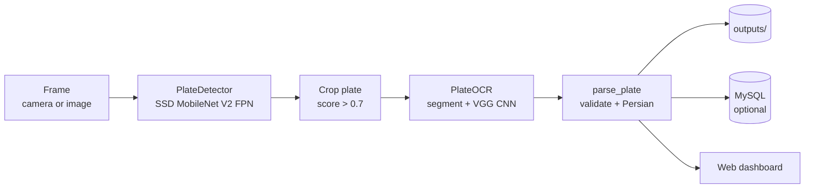

# Persian License Plate Recognition

End-to-end detection and recognition of Iranian vehicle license plates.

A fine-tuned **SSD MobileNet V2 FPN** locates the plate in a frame, classical
OpenCV segmentation splits it into characters, and a **VGG-style CNN** trained
on the [Iranis dataset](https://github.com/mut-deep/IRANIS-dataset) reads each
one. The result is validated against the Iranian plate format, resolved to a
province and vehicle category, and stored to disk (and optionally MySQL).

The same pipeline runs in three modes: **offline** on still images, **live**
from a camera, and through a **web dashboard**.

> **📸 [See real output from the pipeline &rarr;](docs/demo.html)**

> **⚠️ Proprietary software.** This code is published for reference only. It is
> **not** open source and may not be used, copied, or modified without prior
> written permission. See [LICENSE](LICENSE).

---

## راهنمای سریع (فارسی)

```bash
python -m venv .venv && .venv\Scripts\activate    # ویندوز
pip install -r requirements.txt
copy .env.example .env                             # تنظیمات را ویرایش کنید

python scripts/detect_image.py --show              # حالت آفلاین (بدون دوربین)
python scripts/detect_video.py                     # حالت زنده با دوربین
python scripts/run_web.py                          # داشبورد وب
```

- تنظیمات (آدرس دوربین، دیتابیس، آستانه‌ها) همه در فایل `.env` هستند.
- خروجی‌ها در پوشه‌ی `outputs/` ذخیره می‌شوند.
- وزن مدل‌ها و دیتاست‌ها به‌خاطر حجم داخل این ریپو نیستند &mdash;
  بخش [Model weights and data](#model-weights-and-data) را ببینید.

---

## Example result

| Stage | Output |
| --- | --- |
| OCR reads the characters | `97PuV54683` |
| Validated and converted | ۹۷ع۵۴۶۸۳ |
| Province (from `83`) | فارس |
| Category (from `ع`) | حمل و نقل عمومی |

More, with images, on the **[demo page](docs/demo.html)**.

---

## How it works



An Iranian civilian plate is **two digits, one letter, three digits, and a
two-digit province code**. The OCR network emits Latin class names such as
`12PwD35373`; `lpr.plate_format` validates that shape, converts it to Persian
(`۱۲♿۳۵۳۷۳`), and looks up the province and category.

The letter's position is enforced. Misordered OCR output such as `1235373D` is
rejected with a reason rather than silently reassembled into a different but
valid-looking plate.

---

## Project layout

```
.
├── configs/            pipeline.config, label_map.pbtxt
├── lpr/                the library — all logic lives here
│   ├── config.py       every path and tunable, .env-aware
│   ├── detector.py     plate localisation
│   ├── ocr.py          character segmentation + recognition
│   ├── plate_format.py validation, Persian conversion, province lookup
│   ├── plate_data.py   reference tables (letters, provinces, categories)
│   ├── plate_render.py draws a plate onto the clean template
│   ├── camera.py       threaded, self-reconnecting video capture
│   ├── storage.py      file + database persistence
│   ├── pipeline.py     ties it all together
│   ├── vgg.py          the OCR network architecture
│   └── web/            Flask dashboard
├── scripts/            command-line entry points
├── assets/             Persian fonts and the blank plate template
├── docs/               demo page and its images
│
└── (not in this repository — see below)
    models/             trained weights
    data/               datasets and TFRecords
    outputs/            runtime captures
    third_party/        vendored TensorFlow Object Detection API
```

---

## Setup

Requires **Python 3.9–3.11**.

### 1. Install dependencies

```bash
python -m venv .venv
.venv\Scripts\activate          # Windows
source .venv/bin/activate       # Linux / macOS

pip install -r requirements.txt
cp .env.example .env            # then edit it
```

> **TensorFlow version matters.** `requirements.txt` pins `<2.16` because
> TensorFlow 2.16 switched to Keras 3, which removed `ImageDataGenerator` and
> cannot load the `.h5` OCR model this project uses.

### 2. Fetch the Object Detection API

The API is not vendored in this repository. Clone it and compile its protobufs:

```bash
git clone --depth 1 https://github.com/tensorflow/models third_party/tensorflow_models
cd third_party/tensorflow_models/research
protoc object_detection/protos/*.proto --python_out=.
cd ../../..
```

`import lpr` adds `third_party/tensorflow_models/research` (and its `slim`
sub-package) to `sys.path`, so **no `pip install` of `object_detection` is
needed**.

### 3. Model weights and data

Trained weights and datasets are excluded from version control because of
their size. Recreate or supply this structure:

```
models/
├── detection/      SSD checkpoints — ckpt-52 is the trained one (~110 MB)
├── ocr/            trained_VGG_model.h5 (~23 MB) + labels
└── pretrained/     COCO checkpoint used as the fine-tuning start
data/
├── images/         train/ and test/ — photos + LabelImg XML
├── records/        TFRecords built from those annotations
├── samples/        sample photos for offline mode
└── ocr_chars/      Iranis dataset, one folder per character class
```

To train them yourself, see [Retraining](#retraining). To use existing
weights, drop them into `models/` with the names above.

> If you want the weights tracked in git, use
> [Git LFS](https://git-lfs.com) — GitHub rejects files over 100 MB.

---

## Usage

### Offline — still images (no camera needed)

```bash
python scripts/detect_image.py                      # all of data/samples/
python scripts/detect_image.py photo.jpg --show
python scripts/detect_image.py photo.jpg --render   # also draw a clean plate
python scripts/detect_image.py photo.jpg --no-save  # don't touch outputs/
```

### Live — camera, RTSP, or video file

```bash
python scripts/detect_video.py
python scripts/detect_video.py --source 0                 # webcam
python scripts/detect_video.py --source video.mp4
python scripts/detect_video.py --headless                 # no preview window
```

Press `q` in the preview window (or `Ctrl+C`) to stop.

### Web dashboard

```bash
python scripts/run_web.py
python scripts/run_web.py --host 0.0.0.0 --port 8080
```

Then open <http://127.0.0.1:5000>. The dashboard shows the live stream, pushes
each newly recognised plate over Socket.IO, and offers a search page (search
needs the database enabled).

---

## Configuration

Everything is set through environment variables, normally via `.env`. See
[`.env.example`](.env.example) for the full list with comments.

| Variable | Default | Purpose |
| --- | --- | --- |
| `LPR_CAMERA_SOURCE` | `0` | RTSP URL, video file, or webcam index |
| `LPR_DETECTION_CHECKPOINT` | `ckpt-52` | Which checkpoint to restore |
| `LPR_DETECTION_THRESHOLD` | `0.7` | Minimum score to crop a plate |
| `LPR_SEGMENT_MIN_AREA_DIVISOR` | `130` | Smallest blob treated as a character |
| `LPR_SEGMENT_MAX_AREA_DIVISOR` | `30` | Largest blob treated as a character |
| `LPR_DB_ENABLED` | `false` | Turn MySQL storage on |
| `LPR_WEB_PORT` | `5000` | Dashboard port |

**No credentials live in the source code.** The database password and camera
URL come from `.env`, which is gitignored. Never commit it.

---

## Output layout

```
outputs/
└── 2026-08-09/
    ├── 2026-08-09 15-46-48.52.jpg          full frame, boxes drawn
    └── 2026-08-09 15-46-48.52/
        ├── 2026-08-09 15-46-48.52.jpg      cropped plate
        ├── 2026-08-09 15-46-48.52-OCR.jpg  per-character boxes
        └── 2026-08-09 15-46-48.52.txt      recognised text
```

### Database

Optional. When `LPR_DB_ENABLED=true`, two tables are created if missing:

- `Plate(id, plate, plate_fa, province, category, timestamp)`
- `Error(id, Reason, TimeStamp)` — why a capture failed validation

`timestamp` is hundredths of a second since the epoch, which keeps it a
sortable integer while preserving capture precision.

---

## Retraining

### Detector

```bash
# 1. Annotate images with LabelImg into data/images/{train,test}/
python scripts/xml_to_csv.py            # XML -> CSV
python scripts/generate_tfrecord.py     # CSV -> TFRecords

# 2. Train (paths in configs/pipeline.config are relative to the repo root)
python scripts/train_detector.py --num-train-steps 50000

# 3. Optional
python scripts/train_detector.py --eval
python scripts/train_detector.py --export
```

New checkpoints land in `models/detection/`. Point
`LPR_DETECTION_CHECKPOINT` at the one you want to use.

### Character OCR

```bash
python scripts/train_ocr.py --epochs 100
python scripts/train_ocr.py --output-dir models/ocr_v2   # keep the old model
```

Training data is `data/ocr_chars/`, one folder per class. The script refuses
to overwrite an existing model unless you pass `--force`.

---

## Troubleshooting

**`ModuleNotFoundError: No module named 'object_detection'`**
The API was not cloned, or its protobufs were not compiled. See
[Setup step 2](#2-fetch-the-object-detection-api).

**The camera never connects**
Check `LPR_CAMERA_SOURCE`. The reader retries forever and logs
`[camera] stream dropped, reconnecting...`; it will not crash the pipeline.

**Characters are split badly / merged**
Retune `LPR_SEGMENT_MIN_AREA_DIVISOR` and `LPR_SEGMENT_MAX_AREA_DIVISOR`.
Bigger divisor = smaller area threshold. Inspect the `-OCR.jpg` output to see
exactly what was segmented.

**MySQL errors on startup**
Set `LPR_DB_ENABLED=false`. Storage degrades gracefully: results are always
written to `outputs/` regardless.

---

## Privacy and legal

This software performs automated recognition of vehicle license plates, which
is personal data in many jurisdictions. Before deploying it, make sure you
have a lawful basis for the capture, an appropriate retention policy for
`outputs/` and the database, and any signage or notification your local law
requires. You are responsible for compliance.

---

## License

**Proprietary — all rights reserved.** No permission is granted to use, copy,
modify, or distribute this software. Publishing the source here does not make
it open source. See [LICENSE](LICENSE) for the full terms and
[NOTICE](NOTICE) for third-party components, which keep their own licences.

For permission requests: **soroosh1267@gmail.com**

> Note: a public GitHub repository still lets anyone view and fork the code
> under GitHub's Terms of Service, whatever the LICENSE says. If you need the
> code to stay genuinely private, make the repository private instead.
